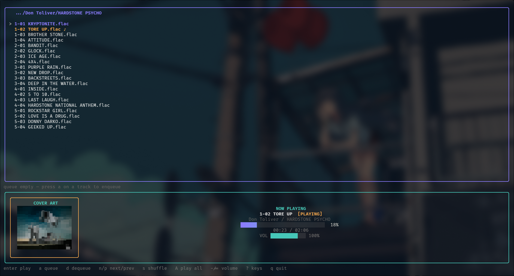

# khzgo

A minimal terminal music player. Browse your library, queue tracks, and play through mpv with cover art rendered right in the terminal.

## Screenshot

<!-- TODO: add screenshot -->



## Install

Runtime dependencies: `mpv`, `ffmpeg`, `chafa` — khzgo checks for them at
startup and tells you if anything is missing (cover art degrades gracefully
without `chafa`/`ffmpeg`).

**go install** (requires Go 1.26+):

```sh
go install github.com/Prs96/khzgo@latest
```

**Build from source**:

```sh
git clone https://github.com/Prs96/khzgo.git
cd khzgo
go build
./khzgo ~/Music
```

Prebuilt linux/amd64 and linux/arm64 tarballs are also available on the
[releases page](https://github.com/Prs96/khzgo/releases).

Run `khzgo` with no arguments to start in `~/Music` when it exists, otherwise
in the current directory. Use `-h` for flags and `-v` for the version.

## Keys

| Key                | Action                          |
| ------------------ | ------------------------------- |
| `enter` / `l`      | play selected                   |
| `a`                | add to queue                    |
| `d`                | remove from queue               |
| `s`                | shuffle-play this folder        |
| `A`                | play all (folder order)         |
| `n`                | next (random if queue empty)    |
| `p`                | previous track                  |
| `<` / `>`          | seek backward / forward 10s     |
| `x`                | stop playback                   |
| `r`                | toggle repeat track             |
| `D`                | clear queue                     |
| `space`            | pause / resume                  |
| `-` / `=`          | volume down / up                |
| `backspace` / `h`  | up one directory                |
| `j` / `k` / arrows | navigate                        |
| `/`                | filter (searches whole library) |
| `?`                | toggle help                     |
| `q`                | quit                            |

## Session

On quit, khzgo saves your session to `~/.config/khzgo/state.json` with last
folder, queue, history, volume, repeat mode, and the current track with its
position. The next launch restores all of it and resumes playback where you
left off (paused tracks come back paused).

## License

[MIT](LICENSE)
